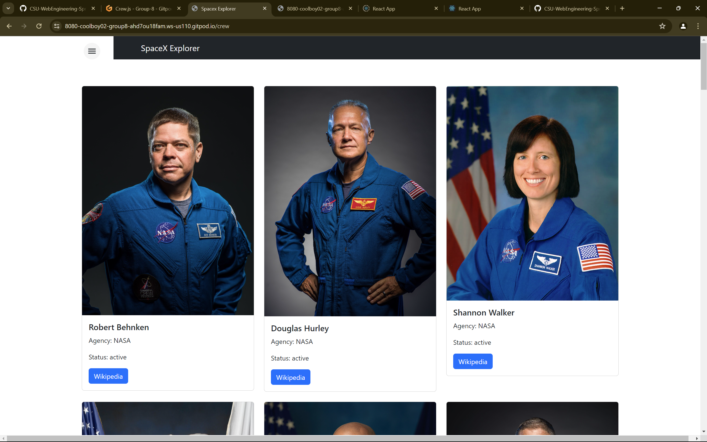
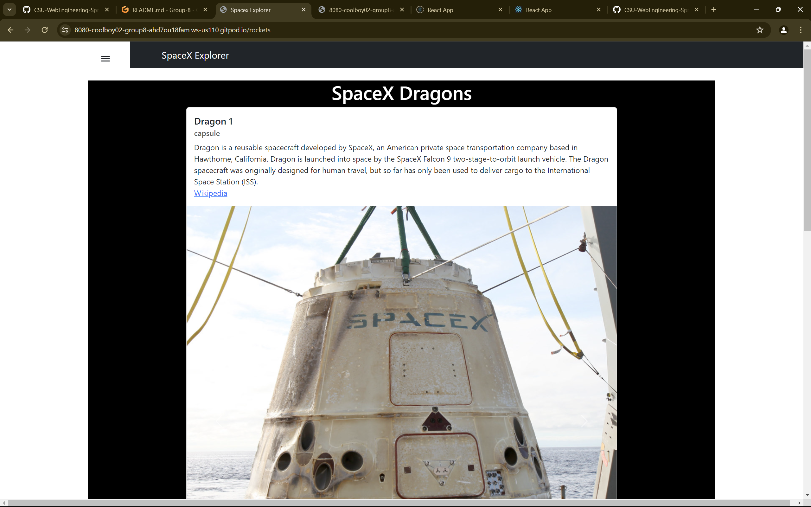
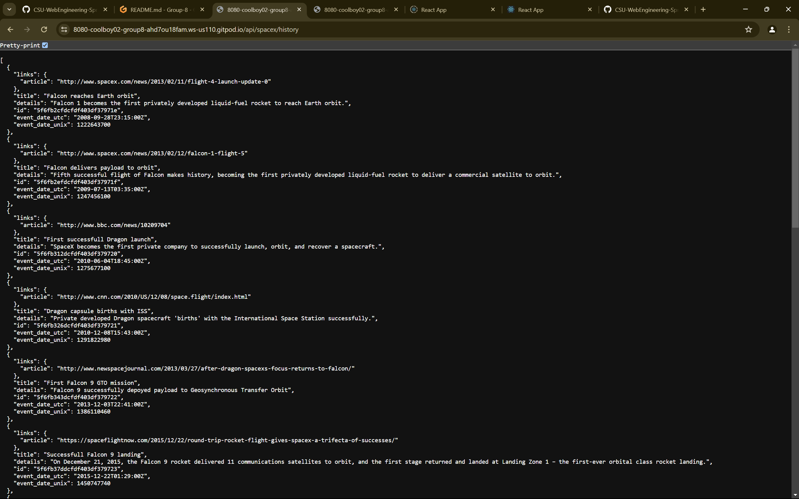
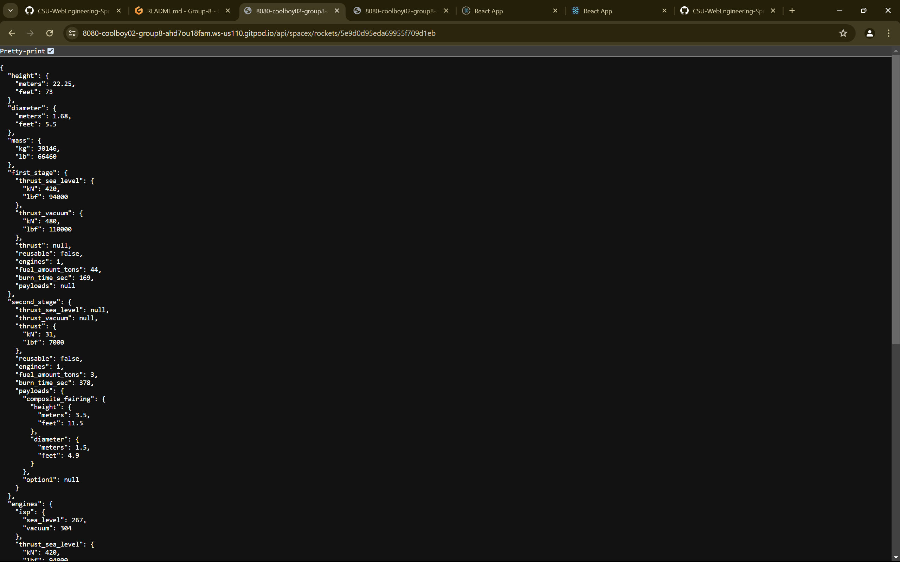
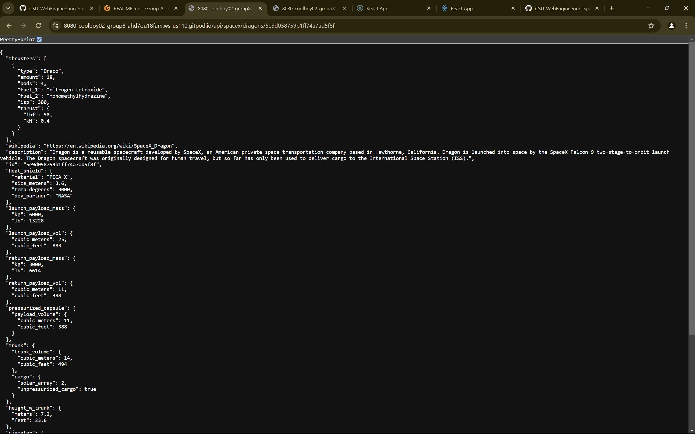
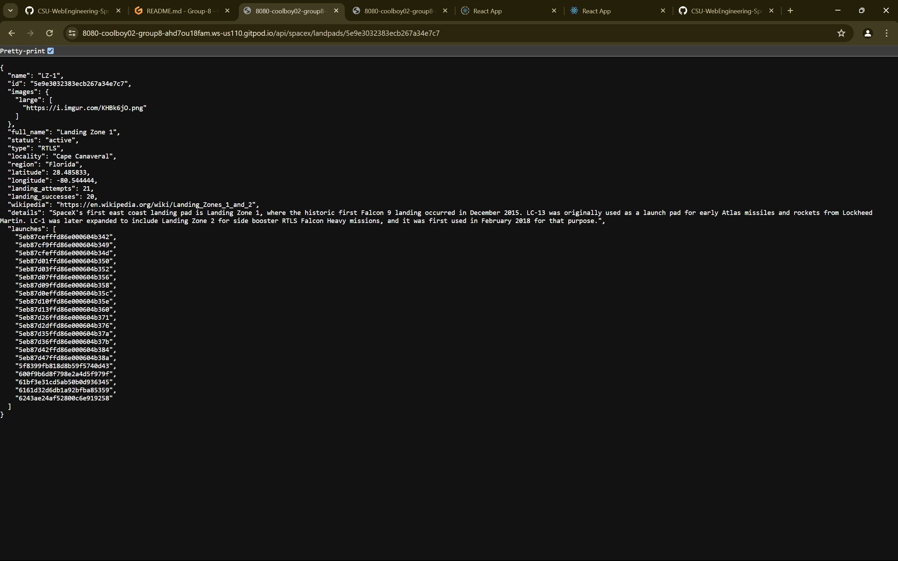

# Group-8


commands to run

```
cd server

sdk install java 17.0.10-amzn

gradle bootrun

```

Demo 1 update


backend api call


Demo 3 Updates















<<<<<<< HEAD
=======

>>>>>>> upstream/HEAD
